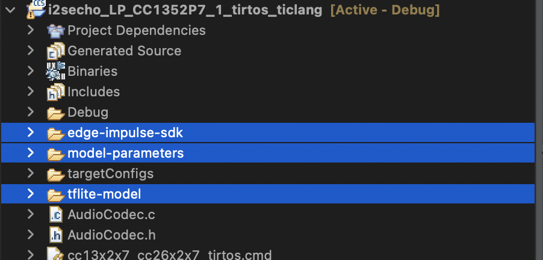
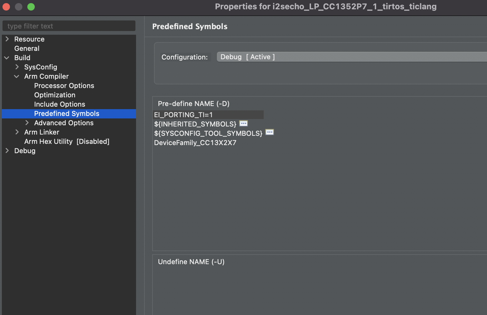

# Edge Impulse + TI Code Composer Examples

This repository provides code snippets and walkthroughs for integrating Edge Impulse with Texas Instruments Code Composer projects. 

## Introduction

[Edge Impulse](https://www.edgeimpulse.com/) deploys trained learning algoritms via an open source C++ library fully compatible with all Texas Instruments `SimpleLink` devices. 

Edge Impulse provides a comprehensive set of [tutorials](https://docs.edgeimpulse.com/docs/development-boards/ti-launchxl) and production grade [firmware examples](https://github.com/edgeimpulse/firmware-ti-launchxl) for the `CC1352 LaunchPad XL` development kits, but when designing for custom hardware, TI users generally need to integrate the Edge Impulse SDK with existing code composer studio projects.

This guide below provides the minimal steps required to integrate any Edge Impulse project into compatible Code Composer Studio projects.

## Requirements
* [TI Code Composer Studio IDE](https://www.ti.com/tool/CCSTUDIO)
* A trained Edge Impulse project

If you are new to Edge Impulse follow our comprehensive [tutorials](https://docs.edgeimpulse.com/docs/development-boards/ti-launchxl) to learn about the platform features. You can also follow the [voice_recognition](./voice_recognition) tutorial in this repository to create and run 

For simplicity's sake, the guide below is written for the `TI ARM Clang` Compiler, and has been tested with [SimpleLink™ CC13x2\_26x2 SDK 6.10.00](https://www.ti.com/tool/SIMPLELINK-CC13XX-CC26XX-SDK). 

Edge Impulse libraries should be compatible with all compilers supporting `c++11`, as well as future SimpleLink SDK versions and devices. However the integration steps may vary slightly based on toolchain and target.

## Add the Edge Impulse library to your project
1. [Deploy](https://docs.edgeimpulse.com/docs/tutorials/deploy-your-model-as-a-c-library#download-the-c++-library-from-edge-impulse) your Edge Impulse project as a C++ Library, and unzip the downloaded archive.

You should see the following directories in your export:

```
edge-impulse-sdk
tflite-model
model-parameters
```

See our [sdk documentation](https://docs.edgeimpulse.com/docs/tutorials/deploy-your-model-as-a-c-library#download-the-c++-library-from-edge-impulse) for details on the library contents.

2. Copy the three directories listed above into the root directory of your code composer project


3. Add the required include paths to your project. Copy the paths below and paste them into `Project -> Properties -> Build -> Arm Compiler -> Include Options`

```
${PROJECT_ROOT}/edge-impulse-sdk/porting
${PROJECT_ROOT}/edge-impulse-sdk/dsp
${PROJECT_ROOT}/edge-impulse-sdk/classifier
${PROJECT_ROOT}/edge-impulse-sdk/CMSIS/DSP/Include/
```


4. For devices using the [SimpleLink™ CC13x2\_26x2 SDK](https://www.ti.com/tool/SIMPLELINK-CC13XX-CC26XX-SDK), enable the TI porting functions built into the Edge Impulse SDK.

Copy the definition below and paste it into `Project -> Properties -> Build -> ARM Compiler -> Predefined Symbols`

```
EI_PORTING_TI=1
```



These built in porting functions implement a set of platform specific methods that the Edge Impulse SDK needs for basic operation. 

These functions are described in `edge-impulse-sdk/porting/ti/ei_classifier_porting.cpp`, and If you are targetting a device not in the `CC13xx_26xx` family, you will likely need to modify the implementations to suit your target platform.

5. At this point, the Edge Impulse library is integrated with your project. However many projects will required modifications to the stack and heap configuration to ensure that there is enough memory available for the Edge Impulse SDK at runtime:

* The call stack depth when running inference is often much larger than standard IoT libraries and applications. As a starting point, The thread, process, or stack that
is to execute the edge impulse sdk should have at least 2kb of space available.

* The required heap usage of an edge impulse project will be shown in the `Deployment` tab in the Edge Impulse Studio. However this is only an estimate and does not include buffers or data structures needed for sampling raw sensor data. It is recommended to configure your heap size to at least twice the size required edge impulse.

From these starting points, code composer offers a robust set of tools for debugging memory usage in the form of the [Runtime Object View](https://software-dl.ti.com/lprf/sdg-latest/html/debugging/ble-common_heap.html). Use these tools to optimize
the memory usage of your application code and Edge Impulse. Additionally, the tutorials in the next section will provide specific instructions and code for changing the heap and stack settings for different wireless stacks and RTOS platforms in code composer.

## Apply workarounds
This section contains known issues and workarounds to specific platforms or toolchain versions. Apply the relevant workarounds to your project.

### * "error: use of undeclared identifier E\*" when using `SIMPLELINK-CC13XX-CC26XX-SDK 5.40.00.40/6.10.00.00`, `TIRTOS`, and `TICLANG 1.30 LTS`

This observed issue occurs due to a SimpleLink SDK conflict when including `<complex>` (required by the Edge Impulse SDK) from the c++ standard library. The error log will appear as:

```
In file included from /Applications/ti/ccs1110/ccs/tools/compiler/ti-cgt-armllvm_1.3.0.LTS/include/c++/v1/complex:242:
In file included from /Applications/ti/ccs1110/ccs/tools/compiler/ti-cgt-armllvm_1.3.0.LTS/include/c++/v1/sstream:184:
In file included from /Applications/ti/ccs1110/ccs/tools/compiler/ti-cgt-armllvm_1.3.0.LTS/include/c++/v1/ostream:137:
In file included from /Applications/ti/ccs1110/ccs/tools/compiler/ti-cgt-armllvm_1.3.0.LTS/include/c++/v1/ios:215:
In file included from /Applications/ti/ccs1110/ccs/tools/compiler/ti-cgt-armllvm_1.3.0.LTS/include/c++/v1/__locale:18:
In file included from /Applications/ti/ccs1110/ccs/tools/compiler/ti-cgt-armllvm_1.3.0.LTS/include/c++/v1/mutex:190:
In file included from /Applications/ti/ccs1110/ccs/tools/compiler/ti-cgt-armllvm_1.3.0.LTS/include/c++/v1/__mutex_base:15:
In file included from /Applications/ti/ccs1110/ccs/tools/compiler/ti-cgt-armllvm_1.3.0.LTS/include/c++/v1/system_error:145:
/Applications/ti/ccs1110/ccs/tools/compiler/ti-cgt-armllvm_1.3.0.LTS/include/c++/v1/__errc:142:43: error: use of undeclared identifier 'EIDRM'
    identifier_removed                  = EIDRM,
                                          ^
/Applications/ti/ccs1110/ccs/tools/compiler/ti-cgt-armllvm_1.3.0.LTS/include/c++/v1/__errc:156:43: error: use of undeclared identifier 'ENOLINK'
    no_link                             = ENOLINK,
                                          ^
/Applications/ti/ccs1110/ccs/tools/compiler/ti-cgt-armllvm_1.3.0.LTS/include/c++/v1/__errc:161:43: error: use of undeclared identifier 'ENOMSG'
    no_message_available                = ENOMSG,
                                          ^
/Applications/ti/ccs1110/ccs/tools/compiler/ti-cgt-armllvm_1.3.0.LTS/include/c++/v1/__errc:163:43: error: use of undeclared identifier 'ENOMSG'
    no_message                          = ENOMSG,

    . . . 
```

To workaround this issue, either revert to Simplelink SDK version 5.20 (or earlier), or modify the file located in `<SDK>\source\ti\posix\ticlang\errno.h`. 

If modifying the SDK, at the end of `errno.h`, find the line that reads:

```
#endif /* ti_posix_ticlang_errno__include */
```

and modify it to read:

```
#include_next <errno.h>
#endif /* ti_posix_ticlang_errno__include */
```

### "filename or extension is too long" when using code composer windows

The tensorflow directory structure inside the edge-impulse-sdk necessitates long object and include paths during linking. This can cause windows systems to hit the command character limit in the ccs console. 

The error will appear as:
```
makefile:951: recipe for target '<project_name>.out' failed

tiarmclang: error: unable to execute command: Couldn't execute program 'C:/ti/ccs1110/ccs/tools/compiler/ti-cgt-armllvm_1.3.0.LTS/bin\tiarmlnk.exe': The filename or extension is too long.  (0xCE)
```

A robust fix for the issue is in progress and will be added in a future release. In the short term, a temporary workaround may be to move your project to a new ccs workspace in `C:/` with a very short workspace and project name. 

## Next Steps & Examples
The library is now integrated, but application code must still obtain formatted sample buffers from sensor input, determine when to classify data, and act on the result. This implementation will vary depending on the type of sensor data.

* [ble_accelerometer](./ble_accelerometer) shows an example of accelerometer data classification, suitable for BLE interop and low frequency time series sensors - e.g. accelerometer, temperature, or other sensors with sampling rates in the 100's of Hz.

* [voice_recognition](./voice_recognition) - shows inferencing with required optimizations for efficiently processing high frequency audio data.

* [sdk documentation](https://docs.edgeimpulse.com/docs/deployment/running-your-impulse-locally/deploy-your-model-as-a-c-library) - shows detailed and sensor generic docs on the data structures, routines, and use of the edge impulse sdk

If you are planning or developing an enterprise application or product with Edge Impulse and Texas Instruments, we also provide dedicated technical support & engineering services for developing production grade edge machine learning solutions. [Contact us](https://www.edgeimpulse.com/contact) to learn more.

