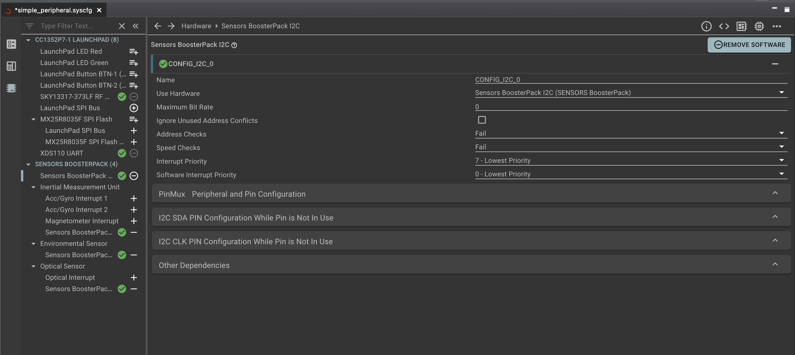

# Acclerometer projects with the BLE5-Stack
This walkthrough starts from the [simple_peripheral](https://dev.ti.com/tirex/explore/node?node=AHkS7uUGcCCoQPnM1CZygg__BSEc4rl__LATEST) BLE example in the `SimpleLink CC13xx_26xx SDK` and adds the capability to classify accelerometer based movement via Edge Impulse.

The steps in this walkthrough are also broadly applicable to BLE projects with other types of time series sensors.

## Requirements
* Any items listed in the [simple_peripheral documentation](https://dev.ti.com/tirex/explore/node?node=AHkS7uUGcCCoQPnM1CZygg__BSEc4rl__LATEST)
* [BOOSTXL-SENSORS](https://www.ti.com/tool/BOOSTXL-SENSORS) board

NOTE: This project has been tested with the following:
 * `CC1352P7 LaunchPad` 
 * `SimpleLink CC13xx_26xx SDK v6.1.0`
 * `syscfg_1.12.1`
 
 The code and steps below may require modification for other devices, SDK, and syscfg versions.

## Add sources

1. Either using the `Resource Explorer` or `New Project Wizard` in Code Composer, import the example project under [simple_peripheral -> TI-RTOS -> TI Clang Compiler](https://dev.ti.com/tirex/explore/node?node=AMBd8emOu4nstM8hYtKWTg__BSEc4rl__LATEST)

2. Navigate to your accelerometer based Edge Impulse Project. If you do not have one, you can use the [Fall Detector v2](https://studio.edgeimpulse.com/public/46838/latest) Edge Impulse project. This is a trained model designed to detect a wearer falling down, using an accelerometer. Clone this project (top right), and then navigate to the `Deployment` tab and export as a `C/C++ Library`.

2. Follow the base [instructions](../README.md) in this repository to integrate the exported `C/C++ Library` with the `simple_peripheral` project.

4. Copy all `ei_*` files from this directory into the `Application/` directory of the `simple_peripheral` project.

## Configure the project syscfg
The TI `syscfg` tool needs to be modified to generate Timer and UART defines used in the minimal example.

You can follow the steps below for syscfg and sensor integration with any project `.syscfg` (described below) or simply replace the `simple_peripheral` project's syscfg file with the [simple_peripheral.syscfg](./ei_simple_peripheral.syscfg) file in this repository

*IMPORTANT NOTE:* the .syscfg file in this repository is only compatible with the exact tested project, device, sdk, and syscfg version. It will not work properly with other configurations or versions and you will need to modify your syscfg manually.

### Modify the syscfg manually
1. Open `simple_peripheral.syscfg` in the syscfg editor, and navigate to `Software->TI Drivers` and enable `Timer` with default settings.


Now your project will automatically add definitions and config options for profiling inference time

Alternatively you can stub out the `Timer_getMs` and `Serial_Out` function calls in `ei_infer_minimal.cpp`, as well as removing the peripheral initialization code from `ei_init` in the same file. 

This is only recommended if proper inference results have already been debugged, and you need the `UART2` and `Timer` peripherals for other tasks in your application.

2. Disable the BLE display to see edge impulse results over USB.

By default, the BLE stack is printing its status to UART1, and is configured to display over the LaunchPad's serial port. This means that you won't be able to see edge impulse debug prints via the USB debug connection with default config. 

Still in the syscfg editor - navigate to, and click on, `Software -> RF Stacks -> BLE -> Advanced Settings -> Disable The Display Module` 

Then navigate to `Software -> TI Drivers -> Display` and click `Remove All` 

Finally navigate to `Hardware -> CC1352P7 LAUNCHPAD (8) -> XDS110` or similar, and `Use Software` with `UART2`


3. Open [ei_infer_minimal.cpp](./ei_infer_minimal.cpp) and review the code here. `ei_init` initializes the Timer and UART resources configured above as well as the edge impulse sdk. From here, an arbitrary buffer of data can be classified by your Edge Impulse project with `ei_infer`. The results, timing, and any runtime errors will be printed over the USB serial port, and a data structure with all result data is returned.

## Integrate sensors
The steps below are specific to the boostxl accelerometer, but should follow a similar sequence and source code for other sensor types.

1. Copy the `boostxl_sensors` directory into the root of the project. 

2. Add the required include paths to your project. Copy the paths below and paste them into `Project -> Properties -> Build -> Arm Compiler -> Include Options`

```
${PROJECT_ROOT}/boostxl_sensors
```

3. Right click on `simple_peripheral.syscfg` and `Open with` a *text editor*. Add the following line somewhere in the file:

```
const BOOSTXL_SENSORS = scripting.addHardware("/boostxl_sensors/BOOSTXL-SENSORS");
```

3. Save, close, and re-open `simple_peripheral.syscfg` in the *syscfg editor*. You should now see the booster pack configuration in the `Hardware` tab - click on the '+' for `SENSORS BOOSTERPACK (4) -> Sensors BoosterPack I2C`. 

The configuration should now look like the capture below:


Now your project will automatically add definitions and config options needed by the accelerometer driver. 

4. Open [ei_imu_minimal.c](./ei_imu_minimal.c) and review the code. `imu_init` initializes the I2C interface and low level driver. Then `imu_fill_window` is able to repeatedly sample the accelerometer, at 100Hz, until a full window is filled.

## Inferencing loop
With all configuration and sensor integration complete, the final step is to actually collect sensor data and classify it.

1. Create a dedicated task for asynchronously running accelerometer sampling and inference. A simple example is provided in `ei_tirtos_task.cpp`, which can be added by opening `Startup/main.c` and adding the following code to `main`

``` c
63 #include "ei_tirtos_task.h"

. . .

154    ei_create_task();

. . .
```

2. Open [ei_tirtos_task.cpp](./ei_tirtos_task.c) and review the code. Here, a dedicated thread with a suitable stack size is created to run the edge impulse sdk and accelerometer driver.

Then, in a continuous loop, a buffer of accelerometer data is collected at 100Hz. Once the data is collected, `ei_infer` classifies the data. In this minimal example, the result is unused except for debug printing. 

Add your own application logic after `ei_infer` to handle the result from running inference on a buffer of sample data. In future releases, examples for characteristics and BLE transmission will be provided.